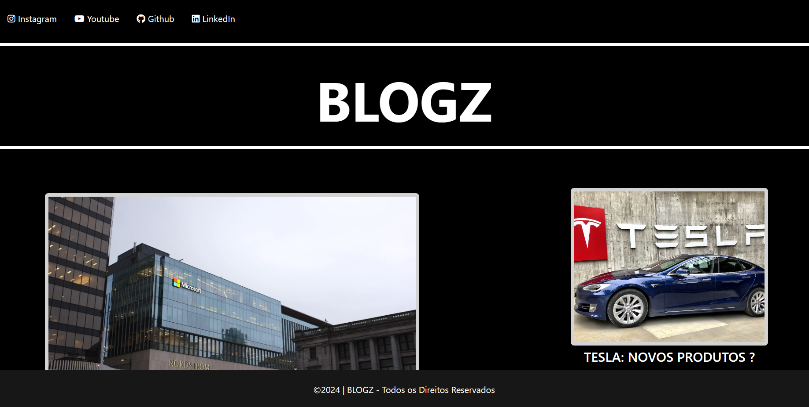

# Projeto Angular Blog

## Objetivo
Este projeto foi criado para praticar alguns conceitos aprendidos durante o Bootcamp. O objetivo principal é começar a desenvolver um blog usando Angular.

## Tecnologias Utilizadas
- Angular
- TypeScript
- HTML
- CSS

## Pré-requisitos
Antes de começar, você vai precisar ter instalado em sua máquina as seguintes ferramentas:
- Node.js
- Angular CLI
- Git
- Visual Studio Code ou IDE de sua preferência

## Como Usar
1. Clone o repositório para a sua máquina local usando `git clone`.
2. Navegue até a pasta do projeto e execute `npm install` para instalar as dependências.
3. Execute `ng serve` para iniciar o servidor de desenvolvimento.
4. Abra o navegador e navegue para `http://localhost:4200/`.

## Autor
#

## Contribuição
#

## Contato
#

## Licença
Este projeto está licenciado sob a Licença MIT.
